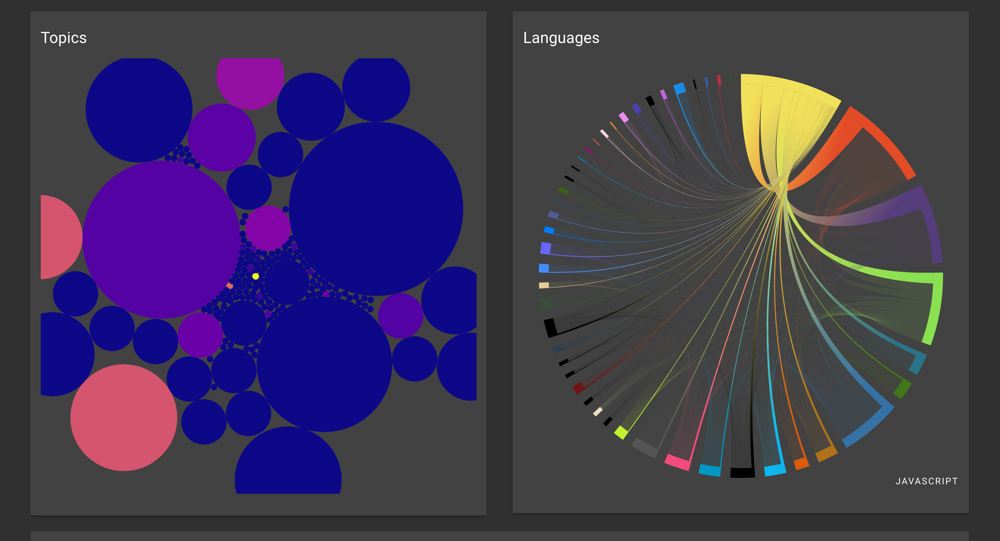

Leverage agile frameworks to provide a robust synopsis for high level overviews. Iterative approaches to corporate strategy foster collaborative thinking to further the overall value proposition. Organically grow the holistic world view of disruptive innovation via workplace diversity and empowerment.

Bring to the table win-win survival strategies to ensure proactive domination. At the end of the day, going forward, a new normal that has evolved from generation X is on the runway heading towards a streamlined cloud solution. User generated content in real-time will have multiple touchpoints for offshoring.
